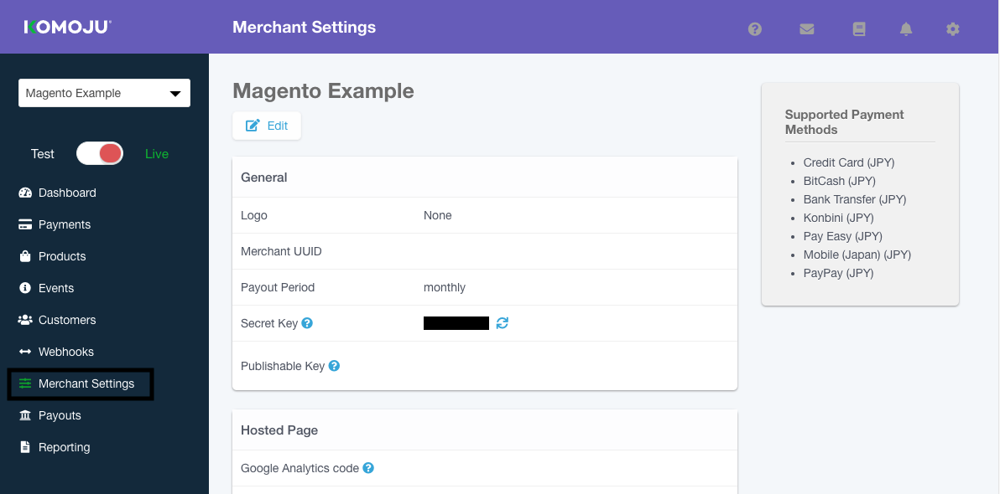
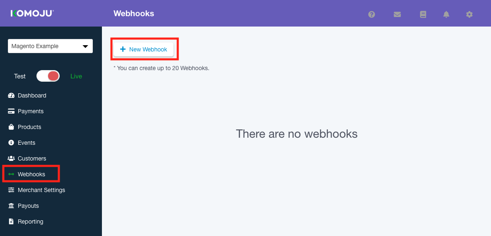
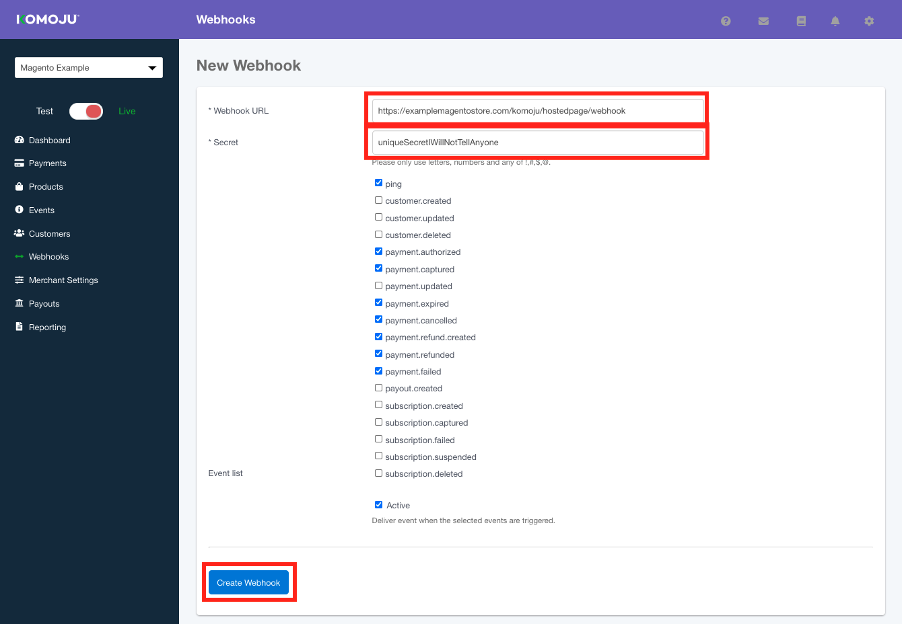

# KOMOJU Magento Plugin

This plugin allows for Magento store owners to accept payments through Komoju. Currently the plugin supports the following currencies:

- JPY

And the following payment methods:

- Credit Card (クレジットカード)
- Convenience Store (コンビニ)

## Installation instructions

**NOTE:** You will need a [KOMOJU account](https://komoju.com/) to be able to use the plugin.

### Installing the module manually

1. Download the module from [here](https://github.com/komoju/komoju-magento/archive/master.zip)
2. Upload the folder to your magento server
3. Unzip the folder to the /tmp directory
```
$ unzip komoju-magento-master.zip "komoju-magento-master/src/app/code/*" -d /tmp
```
4. Copy the module code to your `$MAGENTO_INSTALL/app/code` folder, where MAGENTO_INSTALL is the directory where Magento is installed:
```
$ mv /tmp/komoju-magento-master/src/app/code/* $MAGENTO_INSTALL/app/code
```
5. Install the new module with the following commands:
```
$ php bin/magento setup:upgrade
$ php bin/magento setup:di:compile
$ php bin/magento cache:flush
$ php bin/magento setup:static-content:deploy
```

## Configuring the plugin

Once the plugin has been installed you will need to configure it. Go to the store configuration in the admin section and navigate to the payment methods. Here you will be able to configure the KOMOJU plugin, with your KOMOJU account details. Your account details can be found on the [KOMOJU merchant settings page](https://komoju.com/admin/merchant_settings):



When configuring the "API Settings" section of the plugin use the following values:

"Merchant UUID" in the plugin is "Merchant UUID" in the Merchant Settings dashboard.
"Secret Key" in the plugin is "Secret Key" in the Merchant Settings dashboard.

### Configuring the KOMOJU webhook 

To ensure that the Magento plugin works correctly you will need to set up a webhook from your KOMOJU dashboard to the wordpress instance. To do this you will need to go to your [Webhook page on the KOMOJU dashboard](https://komoju.com/admin/webhooks) and click "New Webhook". The Webhook URL is at `/komoju/hostedpage/webhook` of your Magento website:



If your Magento was `https://magento.komoju.com` then your Webhook URL would be `https://magento.komoju.com/komoju/hostedpage/webhook`. The Secret can be anything you want (as long as you remember it), but you must make sure the following events are ticked:

- payment.authorized
- payment.captured
- payment.expired
- payment.cancelled
- payment.refunded
- payment.refund.created



Once everything is configured as above, then click "Create Webhook" to save the changes.

Go back to the plugin config section in your Magento instance, and enter the webhook secret you just created into the "Webhook Secret Token" field.

## Contact Us

If you have any questions or concerns you can contact our support team at  support@degica.com.